# About the project

DreamStreamer is a AI-driven music streaming service that provides personalized music recommendations based on user preferences. Created for the coursework model 'Enterprise Cloud and Distributed Web Applications'.

## Technologies used

React.js for frontend development
Tailwind CSS for responsive styling
Framer Motion for animations
AWS Services for backend services

## Live demo

[Live demo link](http://d32uficm9gfop7.cloudfront.net)

## AWS Solution Design Diagram for Customer Facing Website

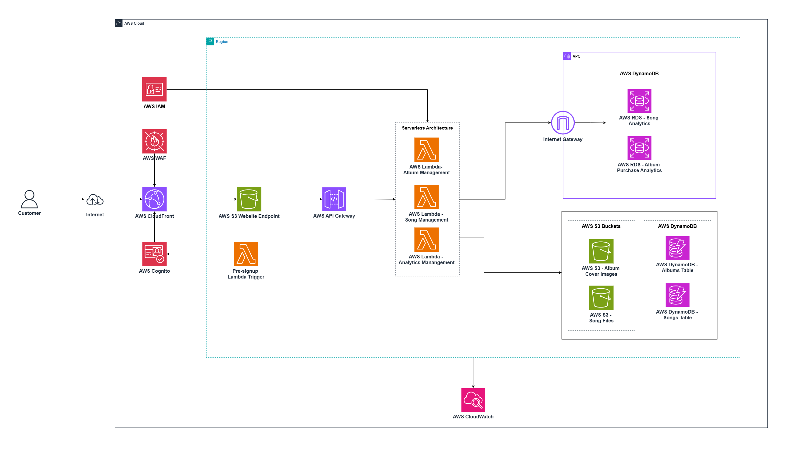

## Screenshots of the UI

### Homepage

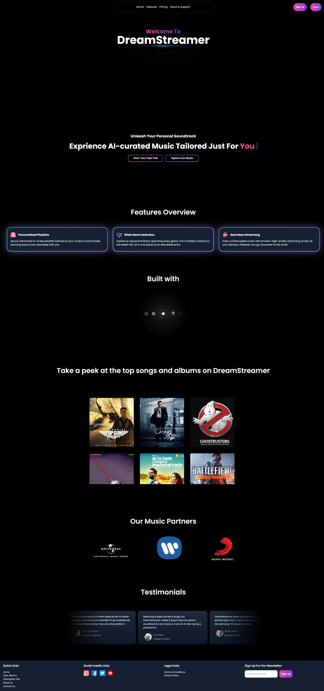

### Features Page

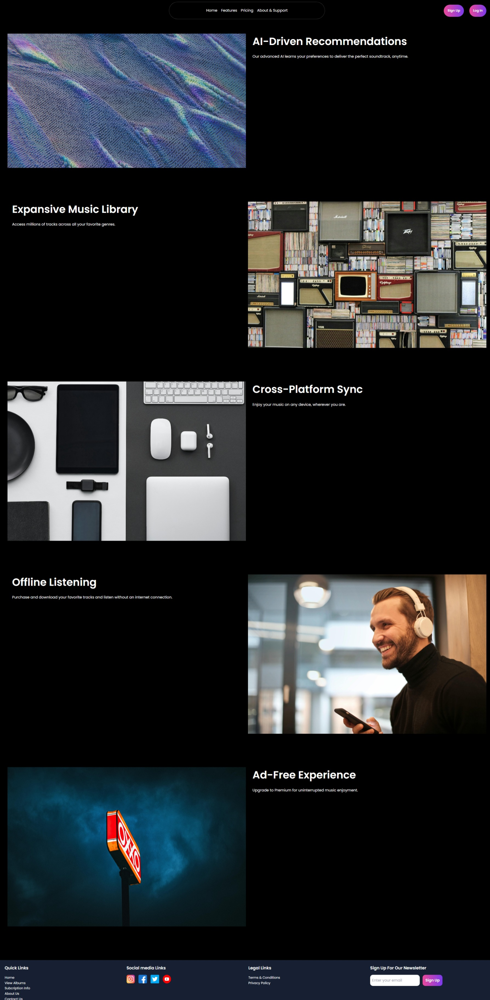

### Albums Page

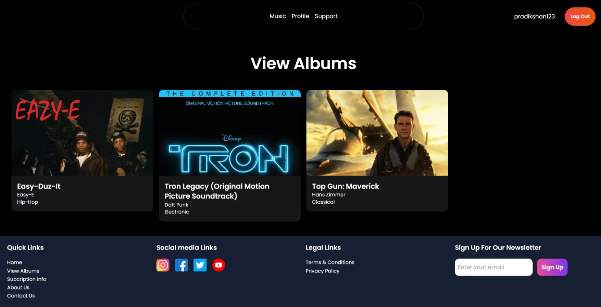
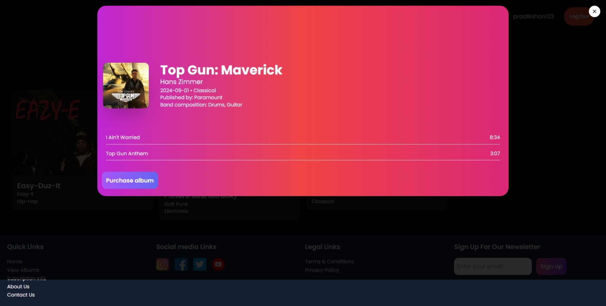

### Songs Page

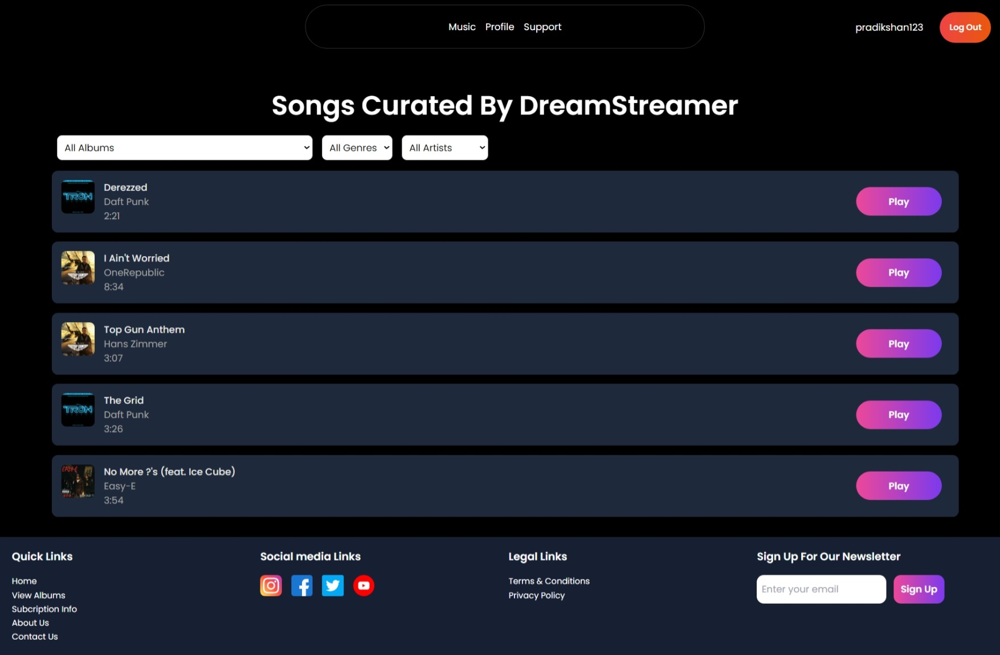
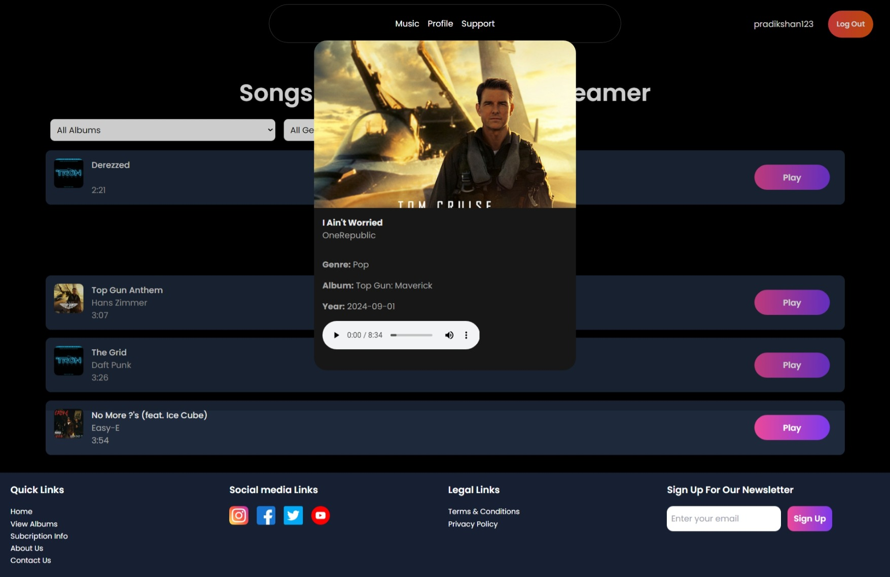

### Pricing Page

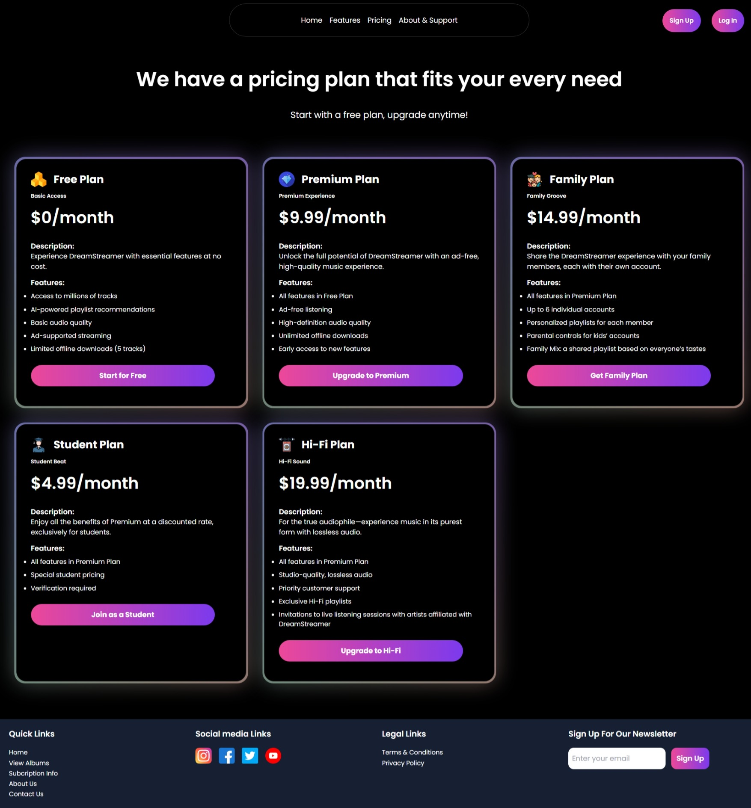

### About Us Page

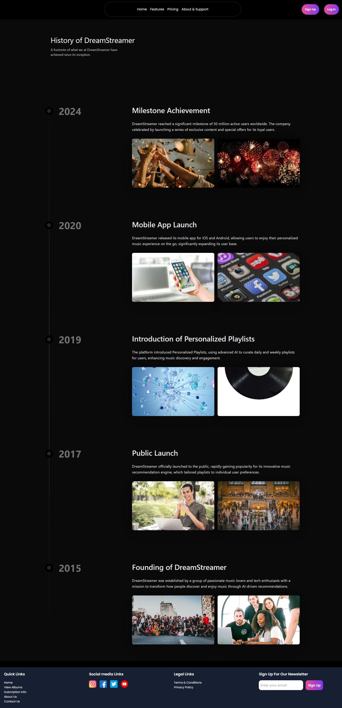

### Support Page

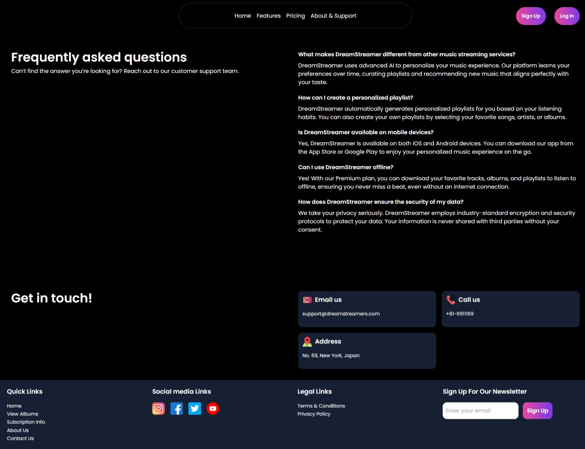

### Profile Page

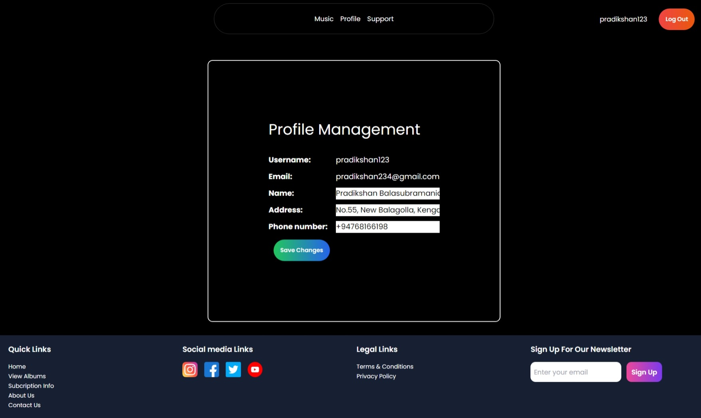

### Signup Page

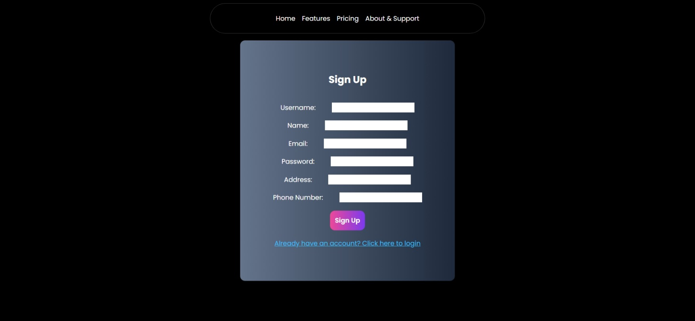

### Login Page

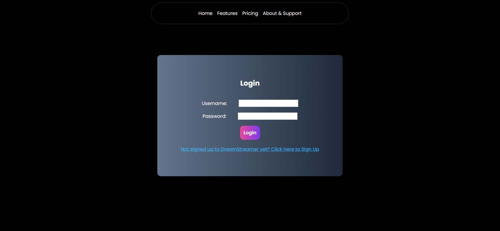

<!-- ## Screenshots of the project

### Homepage

### Floorplan page

### Pricing page

### FAQ page

### About page

### Contact page

 -->
